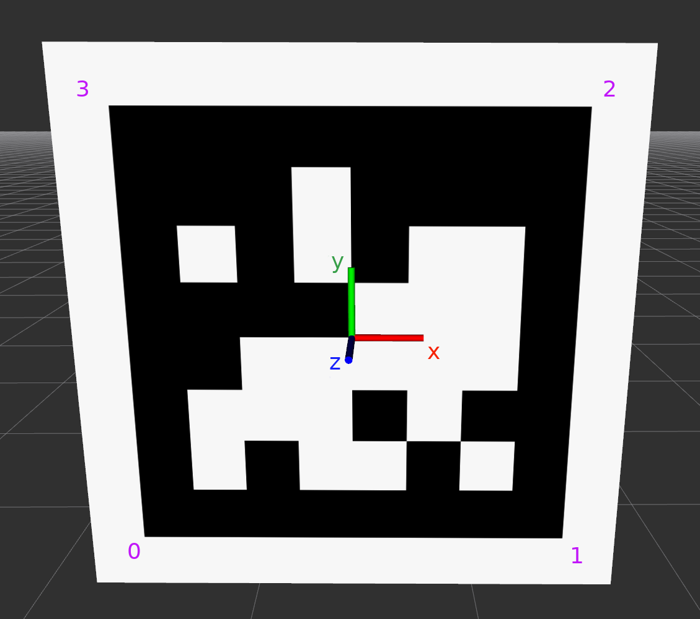

# apriltag-bundle-detector

Lightweight utilities to estimate the 6D pose of an AprilTag bundle from camera images.
The repo provides:
- A reusable detector class (`AprilTagBundleDetector`) for bundle pose estimation, including multi-tag bundle configurations.
- YAML-based bundle layout definitions.
- Demo scripts for offline visualization and live RealSense testing.

## Installation

Python 3.7+ is supported.

```bash
pip install -e .
```

Optional dependency for the live camera demo:

```bash
pip install -e ".[realsense]"
```

## What The Solver Returns

For each configured bundle, the detector returns a transform:
- `T_camera_bundle`: maps points from bundle frame to camera frame.
- If detection fails in a frame, the last valid transform for that bundle is reused.

The core entry point is:
- `apriltag_bundle_detector/solver.py`
- Class: `AprilTagBundleDetector`

## Solver Mechanics

For each bundle in the YAML:
1. Detect AprilTags in the image.
2. For each detected tag that belongs to the bundle, collect:
   - the 4 detected image corners, and
   - the corresponding 3D corners in the bundle frame (via `T_bundle_tag` and tag size).
3. Stack all collected corners from all visible tags into one correspondence set.
4. Run PnP on the full set (then reject high-error tags and solve again on inliers).

Because PnP is solved over all visible tag corners jointly, multi-tag configurations are typically more accurate and stable than single-tag estimation, especially with partial occlusions or noisy individual detections.

## Coordinate Frame Conventions

### Tag Frame
- Origin is at the center of the tag.
- Tag lies in the local `XY` plane (`z = 0`).
- Corner order used by the solver:
  1. `(-s, -s, 0)`
  2. `( s, -s, 0)`
  3. `( s,  s, 0)`
  4. `(-s,  s, 0)`
  where `s = size / 2`.



### Bundle Definition (YAML)
- Each tag entry stores `x,y,z` and quaternion `qx,qy,qz,qw`.
- This defines `T_bundle_tag` (tag frame expressed in the bundle frame).
- Example files:
  - `assets/config_cube.yaml`

## Demo Scripts

### `scripts/demo_online.py`
Live demo with Intel RealSense:
- Captures frames from `SceneCamera`.
- Runs bundle detection each frame.
- Overlays either:
  - 3D axes (`--ref-display axes`, default), or
  - bundle origin circles (`--ref-display circle`).

Run:
```bash
python scripts/demo_online.py
```

### `scripts/demo_offline.py`
Open3D visualization of bundle layout from YAML (requires open3d):
- Loads bundle/tag transforms from config.
- Renders one coordinate frame per tag plus the bundle frame.
- Labels tags by id.

Run (recommended to pass a valid local config path):
```bash
python scripts/demo_offline.py
```
